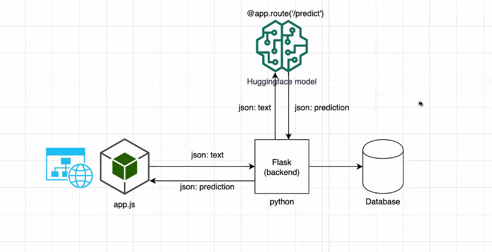

# Sentiment Analysis 
### Team Name:
Amewsing Corgis

### Team Members:
- Jace Loo
- Ryan Cabaong
- Tanzia Chaudhury Islam

## Overview
Our team's aim is to produce an accurate sentiment analysis of texts by using machine learning and natural language processing library called Hugging Face. The purpose of this project is to understand and analyze reviews, thoughts and emotions for any given movie, products, and just plain texts.

Our dashboard would allow researchers to gauge sentiment surrounding any topic that has been written about with some level of judgment or opinion, through chart and visual representations. These topics would include different forms of media such as books and video games, social media posts (via comments), products and new product announcements, and events. Beyond that, it would generate transcripts from audio and video reviews such as podcasts, YouTube videos, etc to allow a broader source of review information for sentiment analysis of a topic.

## Website URL and PowerPoint
Below is the link of a powerpoint presentation that summarizes our overall goals. 

Currently, we have created a dashboard, that allows users to type in a message. From the provided message, we will attempt to tell whether it is a positive or negative message. We also show the emotions behind the message using a pie chart. Here is the link to our dashboard and our powerpoint: 

### Dashboard link
https://tanzich.github.io/FilmReview-SentimentAnalysis/template/

### Powerpoint link
https://docs.google.com/presentation/d/1WFZHx9kfErvZzy8OBKlEZ0egxSy-XMzn-hx8bBqm9Vg/edit?usp=sharing

## Workflow
Below is an image, that shows our basic work flow. 

### Sentiment Analysis workflow:

In this work flow, we see that :
- User uses our dashboard to send a message.
- The message is passed through an api call to our backend.
- Backend connects with Hugging face with the message.
- Hugging face sends a respond back to our backend.
- Backend connects back to the HTML with the respond. 

# Conclusion
The dashboard currently is a work in progress. In the future, we hope to add more functionality and provide a deeper analysis of user's sentiment. 

